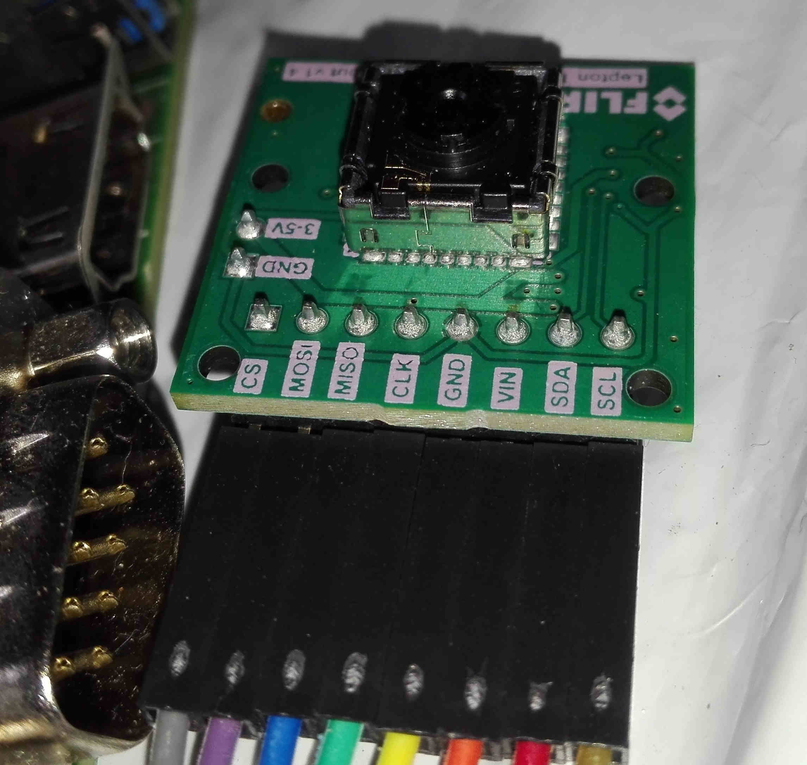
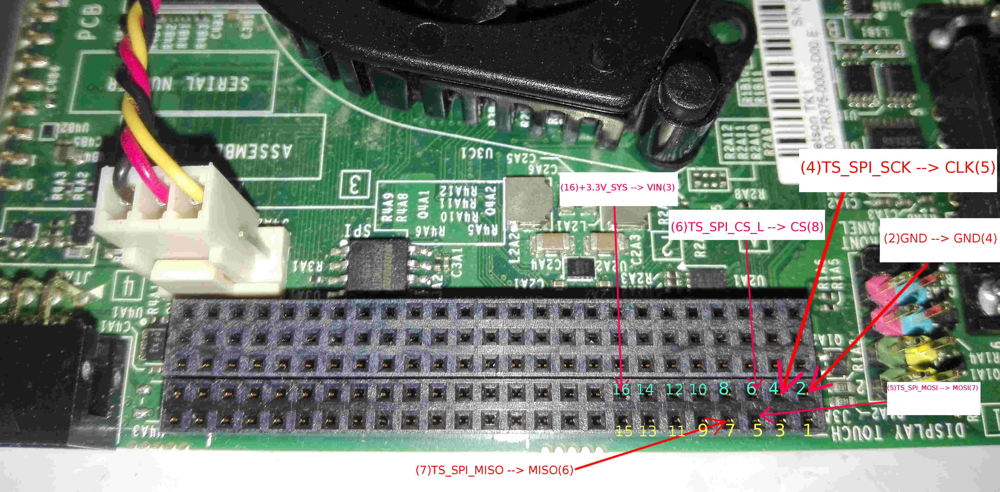
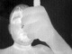

# Introduction
In this post, I will discuss how to connect FLIR [Lepton](https://learn.sparkfun.com/tutorials/flir-lepton-hookup-guide) module with NVIDIA Jetson TK1.If you are new to Jetson TK1 and struggling on how to kick off the development with that , you can refer to my previous [post](http://me.knnect.com/blog/getting-started-with-nvidia-jetson-tk1) to get to know about how to get started with NVIDIA Jetson TK1.In this post I assume, you have already installed Operating system(Ubuntu 14.04) using Jetpack or any other way.
There is an excellent [guide](http://neurorobotictech.com/Community/Blog/tabid/184/ID/13/Using-the-Jetson-TK1-SPI--Part-3-Configuring-SPI-in-the-device-tree.aspx) on how to enable SPI with Jetson TK1 and connect to Arduino Due, It helped me a lot understanding  the hardware capabilities of Jetson TK1 to enable SPI communication , and how kernel device drivers and device tree helps to allow communication with SPI hardware in TK1 with programmers in Operating system level.It is better to first to go through that article up to <a href="http://neurorobotictech.com/Community/Blog/tabid/184/ID/13/Using-the-Jetson-TK1-SPI--Part-3-Configuring-SPI-in-the-device-tree.aspx">part 3</a>.My Jetson TK1 setup is Ubuntu 14.04 installed with Jetpack R21.5 and update the kernel with Grinch 21.3.4 for Jetson TK1.If you have already installed jetpack and running the OS following topic will cover how to install Grinch 21.3.4 kernel, and configure to use SPI.

# Update Kernel

I actually wanted to connect Lepton with Jetson without doing any Kernal modification , so I tried building official kernel enabling the SPI module but It didn't work and ended up with hanging the OS after few seconds of booting. So re-flash the Jetson and tried with latest Grinch kernel.As the steps mention <a href="https://devtalk.nvidia.com/default/topic/906018/jetson-tk1/-customkernel-the-grinch-21-3-4-for-jetson-tk1-developed/">here</a> updating the stock kernel with Grinch kernel is easy.If you have fresh Jetpack installation(In my case Jetpack 21.5). Then run the following commands to update the kernel.
1. Download required firmware,kernel modules and boot zimage files
```
wget http://www.jarzebski.pl/files/jetsontk1/grinch-21.3.4/zImage
wget http://www.jarzebski.pl/files/jetsontk1/grinch-21.3.4/jetson-tk1-grinch-21.3.4-modules.tar.bz2
wget http://www.jarzebski.pl/files/jetsontk1/grinch-21.3.4/jetson-tk1-grinch-21.3.4-firmware.tar.bz2
```
2. Make sure you check the MD5 hash with following (It sometimes download 135K junk file, nothing in it)
```bash
a4a4ea10f2fe74fbb6b10eb2a3ad5409  zImage
3f84d425a13930af681cc463ad4cf3e6  jetson-tk1-grinch-21.3.4-modules.tar.bz2
f80d37ca6ae31d03e86707ce0943eb7f  jetson-tk1-grinch-21.3.4-firmware.tar.bz2
```
3. Then extract and copy the files to system
```shell
sudo tar -C /lib/modules -vxjf jetson-tk1-grinch-21.3.4-modules.tar.bz2
sudo tar -C /lib -vxjf jetson-tk1-grinch-21.3.4-firmware.tar.bz2
sudo cp zImage /boot/zImage
```
4. If you are following original NVIDIA dev post sofa , <strong>stop</strong> here and the coping DTB file into <strong>/boot</strong> directory, Because we have to make some changes before copying the device tree blob file into /boot
<ul>
 	<li>The reason is , we need to change the frequency of the SPI clock or reduce the default Jetson touch SPI CLK frequency to comfortable range to work with Lepton, For that we will decompile the .dtb file and generate the .dts(Device tree source file) and do the modification to the .dts file and the compile the source code using dtc(Device Tree Compiler) and copy the modified device tree blob(.dtb) file to /boot directory</li>
</ul>
So for doing the above task first we need the <strong>dtc </strong>tool, The source code for the dtc comes with the kernel it self in the <strong>kernel/scripts/dtc/</strong> you can compile it and use.Else I have <a href="https://drive.google.com/open?id=0B41dAZxfrYZ0Ylktc3F6WTRMV1U">uploaded</a> here the pre-compiled dtc tool for Jetson TK1 , you can use that if you don't want to do any kernel builds.
<ol>
 	<li>One you have the dtc tool , go to the directory where you have downloaded the <strong>tegra124-jetson_tk1-pm375-000-c00-00.dtb </strong>file and run the following command
```shell
./dtc -I dtb -O dts -o tegra124-jetson_tk1-pm375-000-c00-00.dts tegra124-jetson_tk1-pm375-000-c00-00.dtb
```
</li>
 	<li>Then open the *.dts file from your favourite text editor and locate the section <em><strong>spi@7000d400 </strong></em>and change the below highlighted lines,
```
spi@7000d400 {
                compatible = "nvidia,tegra114-spi";
                reg = &lt;0x0 0x7000d400 0x0 0x200&gt;;
                interrupts = &lt;0x0 0x3b 0x4&gt;;
                nvidia,dma-request-selector = &lt;0x7 0xf&gt;;
                nvidia,memory-clients = &lt;0xe&gt;;
                #address-cells = &lt;0x1&gt;;
                #size-cells = &lt;0x0&gt;;
                clocks = &lt;0xc 0x29&gt;;
                status = "okay";
                dmas = &lt;0x7 0xf 0x7 0xf&gt;;
                dma-names = "rx", "tx";
                spi-max-frequency = &lt;0xF42400&gt;;

                spi0_0 {
                        #address-cells = &lt;0x1&gt;;
                        #size-cells = &lt;0x0&gt;;
                        compatible = "spidev";
                        reg = &lt;0x0&gt;;
                        spi-max-frequency = &lt;0xF42400&gt;;
                        spi-cpha;
                        nvidia,enable-hw-based-cs;
                        nvidia,cs-setup-clk-count = &lt;0x1e&gt;;
                        nvidia,cs-hold-clk-count = &lt;0x1e&gt;;
                        nvidia,rx-clk-tap-delay = &lt;0x1f&gt;;
                        nvidia,tx-clk-tap-delay = &lt;0x0&gt;;
                };
        };

````

I have only change the original <strong>0x17D7840 </strong>value to <strong>0xF42400</strong>, setting the max frequency value from 25MHz to 16MHz</li>

<li>Then compile the device tree source file again and copy it to <strong>/boot</strong> directory, to do that use the following command

```shell
./dtc -I dts -O dtb -o /boot/tegra124-jetson_tk1-pm375-000-c00-00.dtb tegra124-jetson_tk1-pm375-000-c00-00.dts
````

</li>
</ol>
As for the instruction in the Nvidia forum , You should get the <strong>/dev/spidev0.0 </strong>after a restart , But it seems it's not working after Jetpack ~R21.3 onwards.So I google for a solution for this and finally found a workaround to get the SPI work
<h3>Fixing conflicts with Jetson TK1 SPI touch drivers</h3>
After following exact steps as mentioned in <a href="http://neurorobotictech.com/Community/Blog/tabid/184/ID/12/Using-the-Jetson-TK1-SPI--Part-2-Configuring-the-kernel-for-SPI.aspx">neurorobotictech</a> article and <a href="https://devtalk.nvidia.com/default/topic/906018/jetson-tk1/-customkernel-the-grinch-21-3-4-for-jetson-tk1-developed/">grinch</a> kernel update post , I still couldn't get the /dev/spidev0.0 appear in the device directory, So to check what is going on with the kernel , I check for spi logs in <strong>dmesg </strong>and tried to find a clue <span class="lang:default decode:true crayon-inline">dmesg | grep "spi"</span>  it shows that

```
spi-tegra114 spi-tegra114.0: chipselect 0 already in use
spi_master spi0: spi_device register error /spi@7000d400/spi0_0
```

But it was quite confident that , I haven't using that port for any reason,So I further look for what could use this port other than spidev, and finally was able to find the answer from <a href="https://devtalk.nvidia.com/default/topic/883673/jetson-tk1/adding-a-can-bus-with-mcp2515-over-spi/post/4690028/#4690028">this post</a>

<blockquote>This is because the touch controller fails to start up, becuase MCP251x has taken it already. This can be ignored, or you can disable the
touch controller by editing /boot/extlinux/extlinux.conf and setting "touch_id=3@3"</blockquote>
So simply open the <span class="lang:default decode:true crayon-inline ">/boot/extlinux/extlinux.conf</span> file and change the <strong>touch_id </strong>value from <strong>0@0 </strong>to <strong>3@3</strong>, And that's it.Now restart the jetson and check whether the <strong>/dev/spidev0.0 </strong>is there , and most probably you should be able to locate it now.

So let's discuss how to connect the FLIR wire connections physically into Jetson TK1 GPIO adapter.

<h2>Connecting Hardware</h2>
We have bought an FLIR Lepton module with the <a href="http://www.pureengineering.com/projects/lepton">pureengineering</a> lepton breakout board attach from the <a href="https://groupgets.com/manufacturers/flir/products/lepton">groupgets</a>



When I tried to connect the Lepton breakout board to Jetson , the harder part was to find the correct pins for SPI0 in Jetson J3A1 pad, Luckily descriptive explanation about all the GPIO port in Jetson was <a href="http://elinux.org/Jetson/GPIO#Jetson_TK1_GPIO_pinouts">here</a>. Then it was just a matter of picking up the correct pin from Jetson and connect to Lepton via a jumper cable, To make the process easy I have marked the correct pin number and it's named from above <a href="http://elinux.org/Jetson/GPIO#Jetson_TK1_GPIO_pinouts">elinux wiki</a> and the pin name appear in breakout board along with the pin number from right to left starting from <strong>SCL. </strong>

Before start connecting the lines , Make sure you have power off the jetson and unplug it from the power supply.



Now connect the cables and start the jetson TK1 to proceed with the next step, Capturing the data.

BTW Is I2C connections missing ? , No you can simply connect the <strong>SCL</strong> and <strong>SDA</strong> lines from Lepton breakout board to <strong><span style="text-decoration: underline;">18</span> GEN2_I2C_SCL_3.3V</strong>  and <strong><span style="text-decoration: underline;">20</span> GEN2_I2C_SDA_3.3V</strong> and get the I2C working, But I haven't tested this yet.

<h2>Software setup for capturing data from Lepton</h2>
After connecting the device , I still didn't know that whether I have connected the device to right pins or even all the above steps have enabled the SPI in jetson, The next challenge was to make the connection between hardware and software.
I tried with the <a href="https://github.com/groupgets/pylepton">pylepton</a> library from groupgets GitHub repo, and need to do some slight changes to get it work.

One thing is we need to change the <strong>SPEED</strong> constant value in <a href="https://github.com/groupgets/pylepton/blob/master/pylepton/Lepton.py#L45">Lepton.py</a> to <span class="lang:default decode:true crayon-inline ">SPEED = 16000000</span> to make it comply with the <strong>max_frequency </strong>value we specified in device tree source, And also we need to change the <strong>MODE</strong> constant value to <span class="lang:default decode:true crayon-inline ">MODE = SPI_MODE_0</span>  Because according to Jetson TK1 technical reference manual(TRM) ,SPI0 in jetson works in SPI mode0. After making those changes run the <a href="https://github.com/groupgets/pylepton/blob/master/pylepton_capture">pylepton_capture</a> script with sudo permission and you wold be able to take a thermal grayscale image from Lepton.





<a href="https://drive.google.com/open?id=0B41dAZxfrYZ0WXU0NTRRWjMxS3c">Here</a> you can find some raw sample jpg images along with the value received from the Lepton before converting the values to 0-255 range.

<h2>What next. . .</h2>
Next, I will write a post on how to use the thermal data(Not specifically image just raw data) and train a neural network model using Caffe deep learning library to detect human presence.Well, there is a lot of work there in the previous phrase.Will try to put them under one post.Since then good luck connecting the lepton to Jetson :)

References :

<ul>
 	<li>https://goo.gl/6sqUBH</li>
 	<li>http://www.electricstuff.co.uk/lepton.html</li>
 	<li>https://github.com/groupgets/pylepton</li>
 	<li>https://devtalk.nvidia.com/default/topic/740390/?comment=4421685</li>
 	<li>http://elinux.org/Jetson/Installing_OpenCV</li>
 	<li>http://neurorobotictech.com/Community/Blog/tabid/184/ID/13/Using-the-Jetson-TK1-SPI--Part-3-Configuring-SPI-in-the-device-tree.aspx</li>
 	<li>https://github.com/chneukirchen/linux-jetson-tk1/blob/master/Documentation/devicetree/bindings/spi/spi-bus.txt</li>
 	<li>https://learn.sparkfun.com/tutorials/serial-peripheral-interface-spi</li>
</ul>
