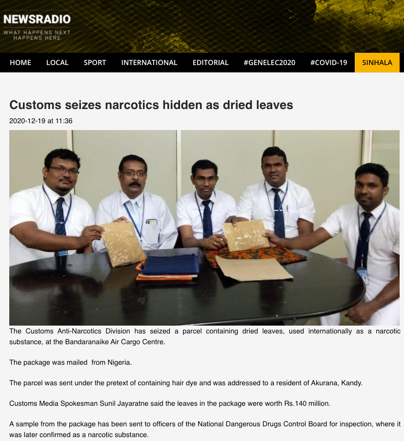

##### Note

> This article does **not** promote nor advice on any illegal, unlawful or unethical importation of any goods into Sri Lanka, If you are planing for such thing this is not the article for you !!
> The intention of this post is to help with the importation process of tech items to Sri Lanka thorough my experience on importing a [WiFi router](https://www.linksys.com/us/p/P-WRT1900ACS/) for my personal use.
> There are various combinations of items, specifications, quantity, purpose etc that leads to completely different experience/process for the importers. (i:e some gadgets (Drones :) ) requires Ministry of Defence approval , Ministry of Health approval and the list goes on and on). So I don't know every one of them and don't cover every thing in this article.

## Know your HS code

Harmonized System Codes or HS codes is simply an identification code for goods or items. HS codes is a standardize numerical method and widely used in my countries to categorize and identify goods in export ot import process. If not for such identification system, It's literally impressible to identify goods by their name.


It's important to know the HS code of the good that you planing to import beforehand, So that you can estimate the tax, and know whether it requires any licence or even it's prohibited item.

You can find more information about HS codes from [here](https://www.trade.gov/harmonized-system-hs-codes)

To find the HS code for your item, You can just google search with the manufacturer name and the model name/number
i:e

```
Linksys WRT 1900 HS code
```

and you will probably find the HS code used in US exports. Then you can find the relevant taxes and tariff applies to the HS codes using the Sri Lanka customs website.
You can find the item description using the [HS finder](http://www.customs.gov.lk/business/hsfinder) and locate the relevant tariff information from [this page](http://www.customs.gov.lk/classification/tarrif)

## Obtaining a Telecommunications Regulatory Commission (TRC) licence

TRC will mainly look at the technical specification of the device, And validate whether it's conform to the Telecommunications regulations in the country. It has a wide spread scope of regulating various devices(RTT), Vendors and more, So what I have experienced is taking a licence for personal use WiFi devices. Obviously the procedure and fess will be differ from the licence type.

I have seen different set of required documents, that needs to be submitted for the licence.But mainly you need submit your NIC copy, and device technical specification, proforma invoice, Application form and etc included in a request letter(email).

Documents required to be submitted in order to issue Custom clearance letters ([source](http://www.trc.gov.lk/images/stories/spectrum/LPspectrumAllocantion1.pdf))

1. Request letter
2. [Application Form](http://www.trc.gov.lk/images/stories/spectrum/LowPowerApplication.pdf) ([Download](http://www.trc.gov.lk/low-power-device.html))
3. Copy of proforma/commercial invoice
4. Technical Specifications
5. Vendor’s Licence where applicable

For technical specification which has the frequency ranges, maximum gain value(s), RF Exposure Information, ect can be found in the product manual most of the time, If not you can search for the device's Federal Communications Commission ID (FCC ID) from the internet and provide those information along with the application.
For example , FCC ID of the Linksys WRT 1900AC V2 router is `Q87-WRT1900ACV2` and you can search for the FCC ID in [fccid.io](https://fccid.io/Q87-WRT1900ACV2) or [fcc.gov](https://www.fcc.gov/oet/ea/fccid)

## Import control licence

Thanks to the pandemic, Now you can apply for ICL via email, You have to fill the information and submit the application form to xxxxx email.

Download the [APPLICATION FOR AN IMPORT CONTROL LICENSE](https://srilankatradeportal.gov.lk/kcfinder/upload/files/DoIEC7AL.pdf)

> **_NOTE:_** I accidentally tries to access `https://srilankatradeportal.gov.lk/kcfinder/upload` and it redirected me to Bangladesh Trade Portal :D, seems like we have taken a clone of their portal and has forgot to change the 302 :D

For more information call `0112326774`,This is the general number of the [Department of Imports and Exports control](imexport.gov.lk) and ask for unit 4 or extension 119.

[This page](http://www.imexport.gov.lk/index.php/en/notices/112-instructions-to-the-applicants-who-personally-importing-phones.html) is also a good source to understand the process of obtaining a license for privately imported hand phones.

## Why all this hassle



> Source : [News Radio](https://www.newsradio.lk/local/customs-seizes-narcotics-hidden-as-dried-leaves/)

All these regulatory bodies and authorities are there to protect the civilian's rights and ensure the well being of all the people in the society, So it's our responsibility to adhere to these guidelines and laws and support.
But at the same time there is a lot to improve on these process to make it smooth for actual buyers.


> Source : [Facebook](https://www.facebook.com/JohnnyFDK/posts/2902701656625133)

## Reference

-   [Drawing](https://excalidraw.com/#room=27703d66db1f97033a51,jKOLhWHyhhqd683XlJeo4Q)
