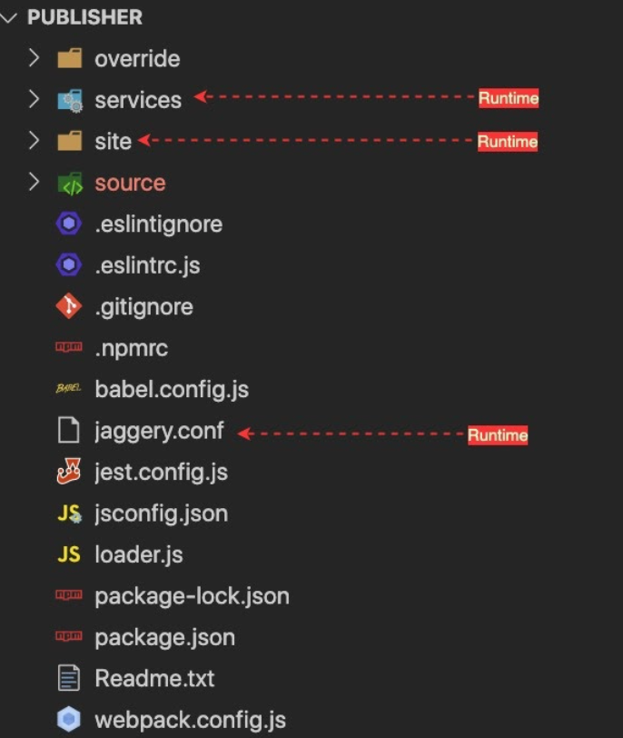
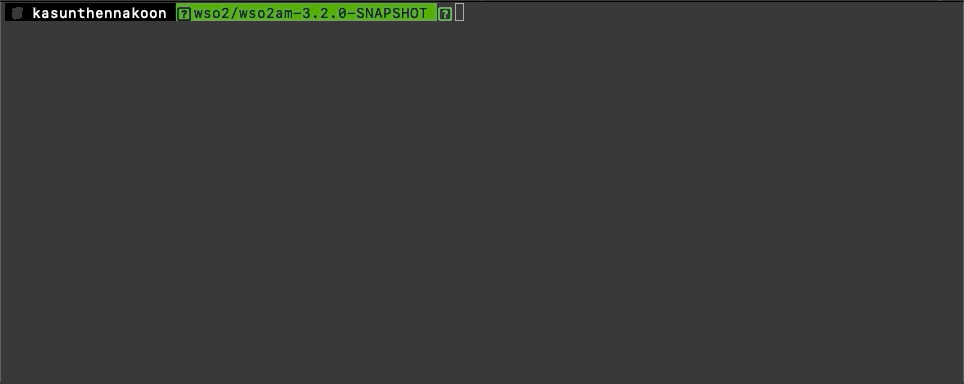
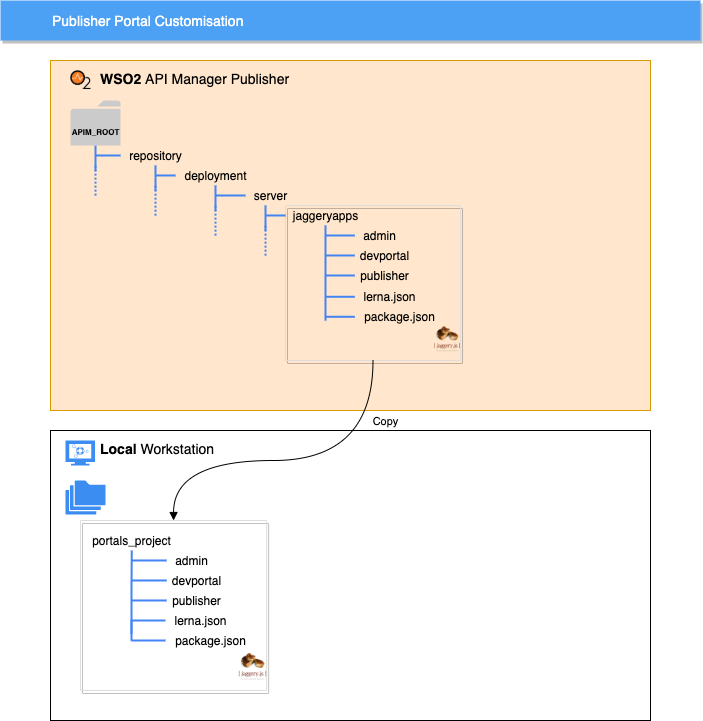
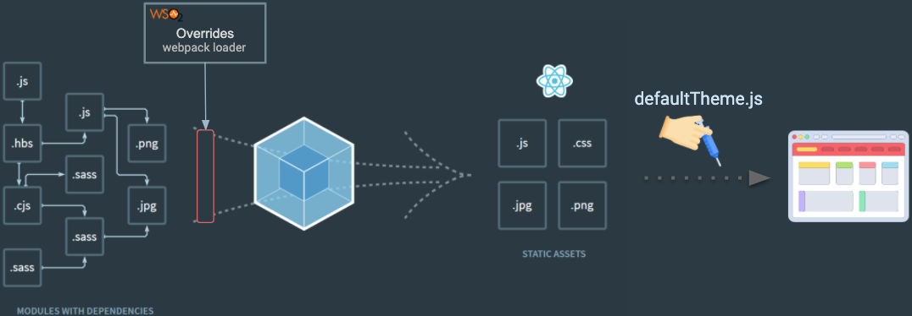
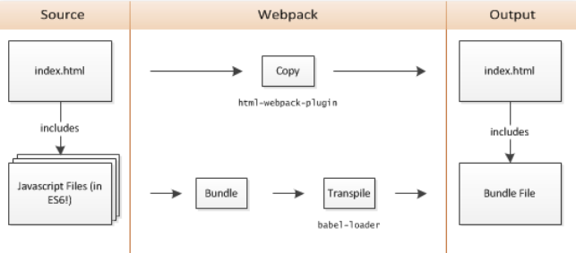
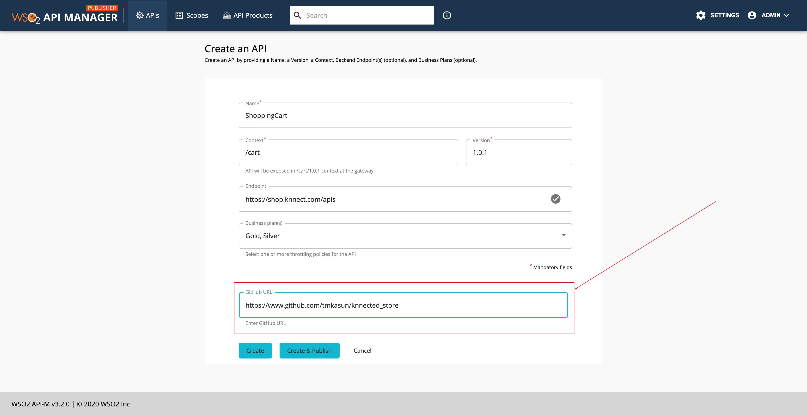
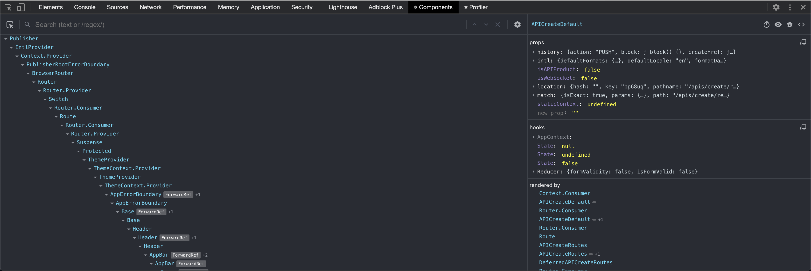
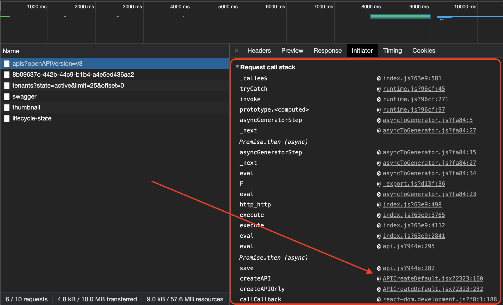
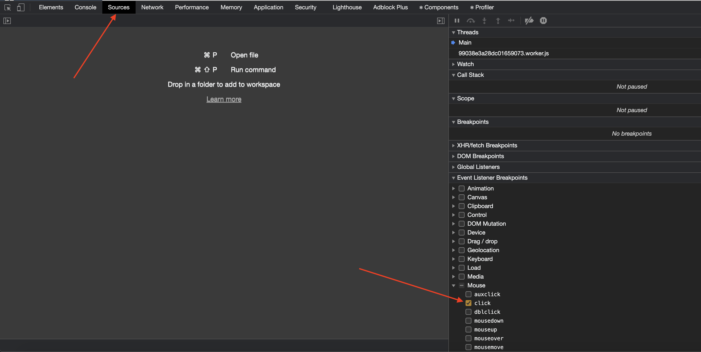
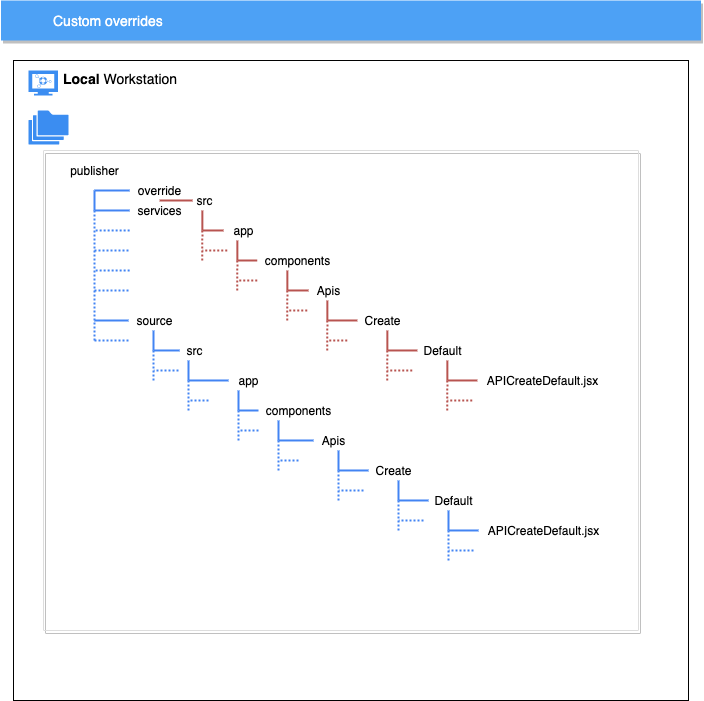

# Preface

If you are already familiar with the WSO2 API Manager product and know about its recent UI revamping, You can skip this section and directly jump into the Introduction.

About [a year ago](https://github.com/wso2/product-apim/releases/tag/v3.0.0) WSO2 API Manager team released the next major version of API Management platform 3.0.0, It was a major version change from its predecessor 2.x. As of the major version change we have done a major UI revamp in the product as well. In version 3.0.0 we removed the JaggeryJS based Publisher & Store portals(Webapps) and built new Publisher & Devportals apps from the ground up using the ReactJS library.  They are 100% client-side rendering single-page applications(SPA) now. You can find more information about this major revamp in [this article](https://medium.com/@tmkasun/wso2-api-manager-new-look-27a186bc83d5).
About 5 months later we released the API Manager 3.1.0 version with many improvements,bug fixes and of course new features. You can find [What’s new in API Manager 3.1.0 portals](https://medium.com/@tmkasun/what-is-new-in-wso2-api-manager-3-1-0-5d37cea741cc) in this article.
And today we are looking at WSO2 API Manager version [3.2.0](https://github.com/wso2/product-apim/releases/tag/v3.2.0), which is the latest version of the API Manager 3.x family (and could be the last of 3.x as well). And as we all expect, 3.2.0 also has many bug fixes and improvements including UI customization improvements as well. 
So that brings us to the topic of this article _Customizing WSO2 API Manager React portals_, without further ado let’s get started!

# Introduction

From API Manager 3.2.0 onwards all 3 portals in the API Manager server are React-based single-page applications. In this article, I will use the Publisher portal to explain the customization mechanism but it's the same for the other 2 portals as well. So the structure of this article is, First I will explain the React portals structure, then

# Structure

First, let’s see how the portal’s source code is organized. The Source of the publisher portal resides in the [carbon-apimgt](https://github.com/wso2/carbon-apimgt/tree/master/features/apimgt/org.wso2.carbon.apimgt.publisher.feature/src/main/resources/publisher) GitHub repository. And when building the product API Manager this source gets copied into 
```
<API_MANAGER_ROOT>/repository/deployment/server/jaggeryapps/publisher/
```
Directory.
Source code in both these locations are same for a particular version and we ship the React apps source code along with the distribution for the customization purpose. Otherwise, You will not need to react application source code in the run time.
Let’s look at how the source code is organized in WSO2 API Manager Publisher portal



This is the source code structure of the publisher portal. Out of these files and directories, We only need services, site, and jaggery.conf files at the runtime, the rest of the source content is for development time requirements, such as dependency management (package\*.json), code quality (eslint.\*), etc.

- **override**

    This folder is used to organize the React component customizations. This is empty in the default pack(distribution).In short, This is where you put your customizations to override the default React UI components.
    
- **services**

    This directory contains the utility services that are required to run the web portals. Even though the React UI portals are fully client-side rendered(CSR) apps, We still need services or proxies for some operations, Such as
    - Authentication
    - Reverse proxy
    - Custom URLs
    
- **site**

    This contains all the static files that are needed to run the portals in the browser. And in fact, this is the directory contains various static files from JS bundles, locale files, theme JSON to favicon. Inside the site, you can find
    ```
    <API_MANAGER_ROOT>/site/public/dist/
    ```
    this directory contains the generated ReactJS application bundles and their     source map files.

- **source**

    This directory contains the Javascript source codes. It contains both implementation and tests. None of the files in here are used in runtime (get loaded into the browser). Here we have split the implementation into two aspects, Data, and Components. Data contains pure javascript implementations of data handling (REST API innovation), Utility functions, and data models (User class). The purpose of these separations is to make the data handling elements shareable and usable in non- ReactJS based projects. And in the Components directory, we maintain the ReactJS Component implementations. It has the whole component hierarchy of the publisher portal.

- **jaggery.conf**

    This is a configuration file used for web apps in Jaggery web server, It contains 
    - routing rules(urlMappings)
    - security constraints
    - welcomeFiles
    
    and other jaggery app-related configurations.
    
    If you are new to JaggeryJS, JaggeryJS is a javascript backend server that can render jaggery style **_.jag_** (like Pug) templates into HTML. Simply put, It’s like NodeJS + Express

- **others**

    The rest of the files are runtime configurations for eslint, jest, webpack, npm. You would probably recognize them by their names.

# Getting started

The first step for customizing the portal app is to take a copy of the portal packages into your development environment. If you take a look at unzipped/exploded API Manager 3.2.0 product distribution(pack), You can find all 3 UI portals inside the 

```<APIM_3.2.0_ROOT_DIRECTORY>/repository/deployment/server/jaggeryapps/ ```



API Manager server contains the portal source codes for bootstrapping the customization work. But it is not intended to do the customizations inside the server directory itself.
So first, copy the entire **jaggeryapps** directory into a desired location. This action is important Because if you follow later steps (Download dependencies, Run production/development build) inside the server itself, it will cause a performance issue in web apps. This performance issue is mainly caused by the sheer number of files getting downloaded when installing the dependencies (because of the **node_modules**). So make sure to take a copy at the beginning of the development.



Now let’s see how to begin the development work.

# Dependency management
API Manager portals use NPM for package management, Except for some of the internally shared components, Such as the API Test console. API Test console React component has shared between the developer portal and Publisher portal So, We have used Lerna for managing those local sharing or intra dependencies.
> **_NOTE:_**  Lerna packages were introduced in WSO2 API Manager 3.2.0, If you are customizing a 3.x version below 3.2.0 (3.0.0 or 3.1.0), You don't need to run below lerna commands

Lerna helps to manage both internal and external public library dependencies by wiring up local dependencies with symbolic links and downloading the external dependencies through the npm public registry. Before integrating the Lerna, we used to run 
```bash
npm ci
```
 to download the dependencies. And now it’s 
 ```bash
 lerna bootstrap
 ```
When customizing the portals, You need to run **lerna bootstrap** from the portal’s parent directory. To make the things easy for the users, we have added an npm alias 
```bash
npm run bootstrap
```
to run the Lerna bootstrap locally.
That is the internals of how package dependencies are managed. But it’s just 2 commands to download dependencies for all 3 apps(Admin, Publisher & Devportal).
First, run 
```bash
npm install
```
from the root directory of your project where the lerna.config and package.json files are located
```
<PROJECT_ROOT>/
```

| | |
|-|-|
|`NOTE` | In here **<PROJECT_ROOT>** refers to the **jaggeryapps/** directory that you have copied in one of the early steps |

Then run 
```bash
npm run bootstrap
```
This will do both downloading and sym-linking local dependencies.

That’s it, Now all the dependent packages are in place, Let see how to build the portal project.

# Build process
API portals use Webpack for bundling the ReactJS and other Javascript dependencies into a Single Page App (SPA) and It follows a typical simple webpack build process. We use a simple webpack loader to integrate the customizations into the build.

The following diagram shows where the loader sits in the application build process.



The loader checks for the files in the **/override** directory and if it found matching files to currently process original source files, then it overrides the content of the original file with the content of the customization and passes forward in the build pipeline. In this way, users can override any implementation in the original source ( in **/source**) by providing a custom implementation in the **/override** directory.
You can check the webpac.config.json file, To learn more about the plugins and loaders that are used in the project.



Another important point to note here is the production and development build commands. We have defined **build:dev** and **build:prod** npm aliases to execute development and production builds. For example, if you want to start/run a development build run the 
```bash
npm run build:dev
```
command from the portals root directory where the **package.json** file is located\.In default distribution publisher portal’s **package.json** is located in

```
/publisher/
```
Directory.

<!-- ---
**NOTE**

It’s recommended to take a copy of the portal project to a different location before working on the customizations (goto **First Step** section if you missed that :) )

---

> **_NOTE:_**  The note content. -->

| | |
|-|-|
|`NOTE` | It’s recommended to take a copy of the portal project to a different location before working on the customizations (goto **First Step** section if you missed that :) ) |


Let’s see how this build process and source structure links in the customization process.

# Customizing React Components

 I will use a simple scenario to explain how the customization works. Let’s assume you want to add a new input parameter to API create page.Where API developers can provide a Github repository URL as a reference for API consumers. So that API consumers or application developers who are interested in this API can explore the code in the Github repository and bootstrap their work.
Let’s see how the Publisher **API create** page UI looks like after making the customization.




We are going to add the input field that is marked with the red rectangle.

### 1. Locating React component

First, you need to locate the file or React component that is rendering the segment that you want to customize. 

- The easiest way to find the React component is to use the [React dev tools](https://chrome.google.com/webstore/detail/react-developer-tools/fmkadmapgofadopljbjfkapdkoienihi). This is a tool developed by React team to help React developers to debug and profile react applications.You can install the extortion/plugin to the browser and use it.

- Another method is to use network trace, If the Interactions  with your target component triggers any network calls , You can use the stack trace in the Browser's network inspector to locate the source component

- Or the other option is to set **Event Listener Breakpoints** from browser Source panel(in Chrome) or Debugger panel (in FireFox). You most probably need to black-box some irrelevant handlers multiple times, But you will get to the original source component at some point, So have some patient when following this method


### 2. Creating the custom React component

Now you know what are/is the component(s) that you want to modify.So in this sample scenario, We have identified that we need to customize the 
```
<PROJECT_ROOT>/publisher/source/src/app/components/Apis/Create/Default/APICreateDefault.jsx
```

| | |
|-|-|
|`NOTE` | In here **<PROJECT_ROOT>** refers to the **jaggeryapps/publisher** directory that you have copied in one of the early steps |

Next step is to implement the custom component in override directory, First create the source file that you want to customize with exact name and relative path (relative to <PROJECT_ROOT>/source ) inside the **<PROJECT_ROOT>/override** directory.
Following diagram shows the source code placement in the original source directory and the override directory.



To begin with you can copy the original implementation from **<PROJECT_ROOT>/source/** directory and do the modifications accordingly, Only downside of this is , When you taking WUM updates, In the WUM updates WSO2 will ship the updated source code, so you will have to manually merge the bug fixes or changes that are done to the original source code.

After working on the customization in override directory, You can run the webpack build to build the portal applications with your customizations. As mentioned earlier you can use

```bash
npm run build:dev
```
for building the portals in development mode, This command will not exit after the initial build until you press Ctrl/Command + C (This is the standard *nix way of signaling a process to abort). So if you create a symbolic link to public directory in WSO2 API manager server's publisher portal

i:e 
```bash
ln -s <PROJECT_ROOT>/site/public/ <API_MANAGER_ROOT>/repository/deployment/server/jaggeryapps/publisher/site/public/
```
Then you can just refresh the page in the browser and see the changes, When a development build is running.


When you finish customizing the portal, You can run following command to trigger a webpack production build
```bash
npm run build:prod
```
This will generate minified and optimized JS bundles in 

```
<PROJECT_ROOT>/site/public/
```
directory, and these bundles will contains the customizations you have put in **override** directory. Now you can copy and replace the 

```
<API_MANAGER_ROOT>/repository/deployment/server/jaggeryapps/publisher/site/public/
```
in WSO2 API Manager server with the newly build artifacts to apply the customizations.

| | |
|-|-|
|`NOTE` | Make sure to copy the entire **<PROJECT_ROOT>/site/public/** directory. Because we are appending a hash value to bundle filenames to avoid stale [cache bundles](https://webpack.js.org/guides/caching/) |

and that's it actually, It very simple process, Isn't it :)

# Summary

In summary, WSO2 API Manager has ReactJS based web portals, and you can customize the UI by overriding the original component implementations. We have implemented a webpack loader to integrate the external customizations into the app bundles when building the portals. Users can provide their customizations in override directory and build the application to integrate customizations into the portal bundles.