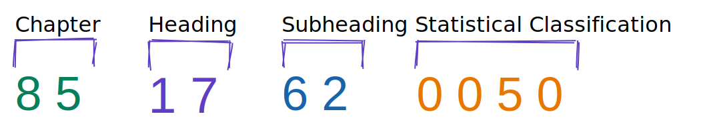
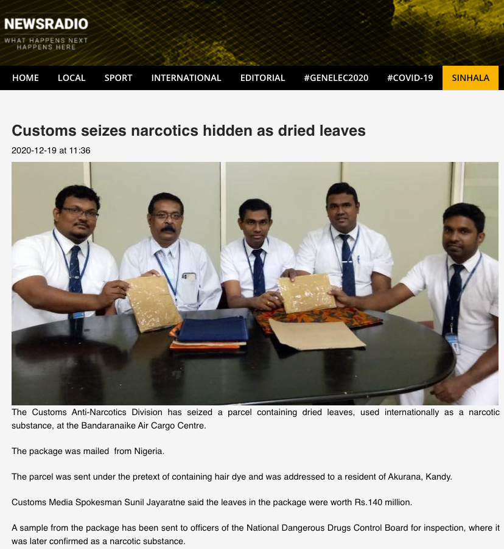
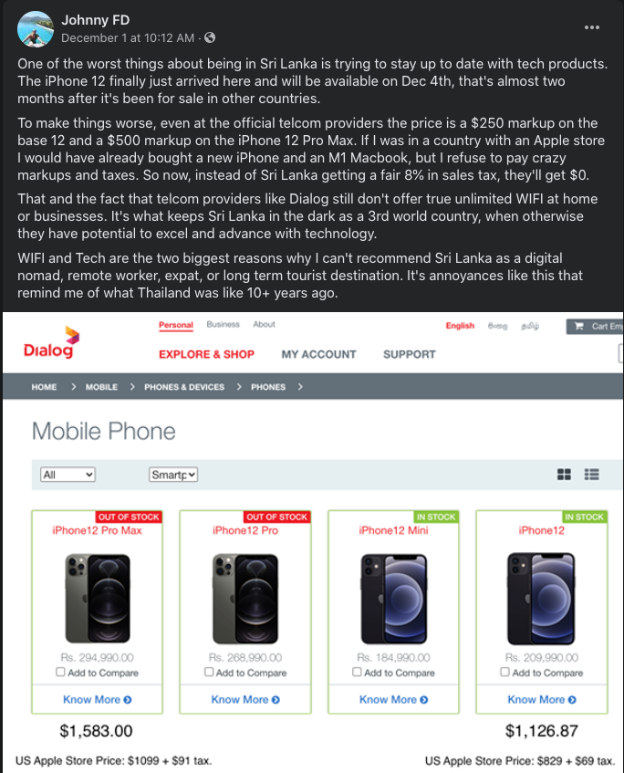

##### Note

>This article does **not** promote nor advice on any illegal, unlawful or unethical importation of any goods into Sri Lanka, If you are planing for such thing this is not the article for you !!
The intention of this post is to help with the importation process of tech items to Sri Lanka thorough my experience on importing a [WiFi router](https://www.linksys.com/us/p/P-WRT1900ACS/) for my personal use.
There are various combinations of items, specifications, quantity, purpose etc that leads to completely different experience/process for the importers. (i:e some gadgets (Drones :) ) requires Ministry of Defence approval , Ministry of Health approval and the list goes on and on). So I don't know every one of them and don't cover every thing in this article.

## Know your HS code

Harmonized System Codes or HS codes is simply an identification code for goods or items. HS codes is a standardize numerical method and widely used in my countries to categorize and identify goods in export ot import process. If not for such identification system, It's literally impressible to identify goods by their name.



It's important to know the HS code of the good that you planing to import beforehand, So that you can estimate the tax, and know whether it requires any licence or even it's prohibited item.

You can find more information about HS codes from [here](https://www.trade.gov/harmonized-system-hs-codes)

To find the HS code for your item, You can just google search with the manufacturer name and the model name/number
i:e
```
Linksys WRT 1900 HS code
```
and you will probably find the HS code used in US exports. Then you can find the relevant taxes and tariff applies to the HS codes using the Sri Lanka customs website.
You can find the item description using the [HS finder](http://www.customs.gov.lk/business/hsfinder) and locate the relevant tariff information from [this page](http://www.customs.gov.lk/classification/tarrif) 

## Why all this hassle


> Source : [News Radio](https://www.newsradio.lk/local/customs-seizes-narcotics-hidden-as-dried-leaves/)

All these regulatory bodies and authorities are there to protect the civilians and ensure the well being of all the people in the country(Sri Lanka), So it's our responsibility to adhere to these guidelines and laws and support.
But at the same time there is a lot to improve on these process to make it smooth for actual buyers.



> Source : [Facebook](https://www.facebook.com/JohnnyFDK/posts/2902701656625133)

## Reference

- [Drawing](https://excalidraw.com/#room=27703d66db1f97033a51,jKOLhWHyhhqd683XlJeo4Q)
