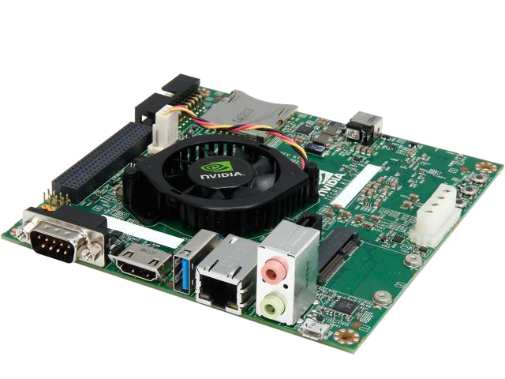

# Introduction

If someone dropped here by a search result, [Nvidia Jetson TK1](https://developer.nvidia.com/embedded/buy/jetson-devkit) is one of the oldest SOC (System on Chip) development board introduced by Nvidia.

# Notes

- [This site](https://elinux.org/Jetson_TK1) contains great level of details about the Nvidia Jetson TK1 board
- [Jetson TK1 development kit specification](http://developer.download.nvidia.com/embedded/jetson/TK1/docs/3_HWDesignDev/JTK1_DevKit_Specification.pdf)
- [My post](https://forums.developer.nvidia.com/t/jetson-tk1-does-not-booting-up/124598) about the power on issue in nvidia forum
- [Schematic diagrams](https://forums.developer.nvidia.com/t/power-on-issues-with-jetson-tk1/35473/6?u=tmkasun)
- [Jetson performance](https://elinux.org/Jetson/Performance)
- [Jetson/Jetson TK1 Power](https://elinux.org/Jetson/Jetson_TK1_Power)

That's all for now :)