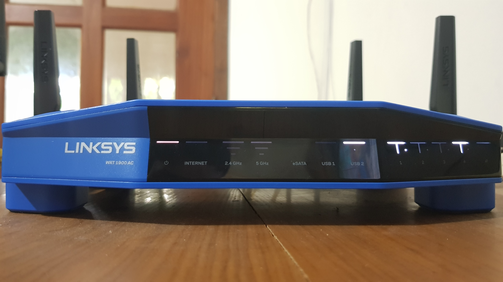
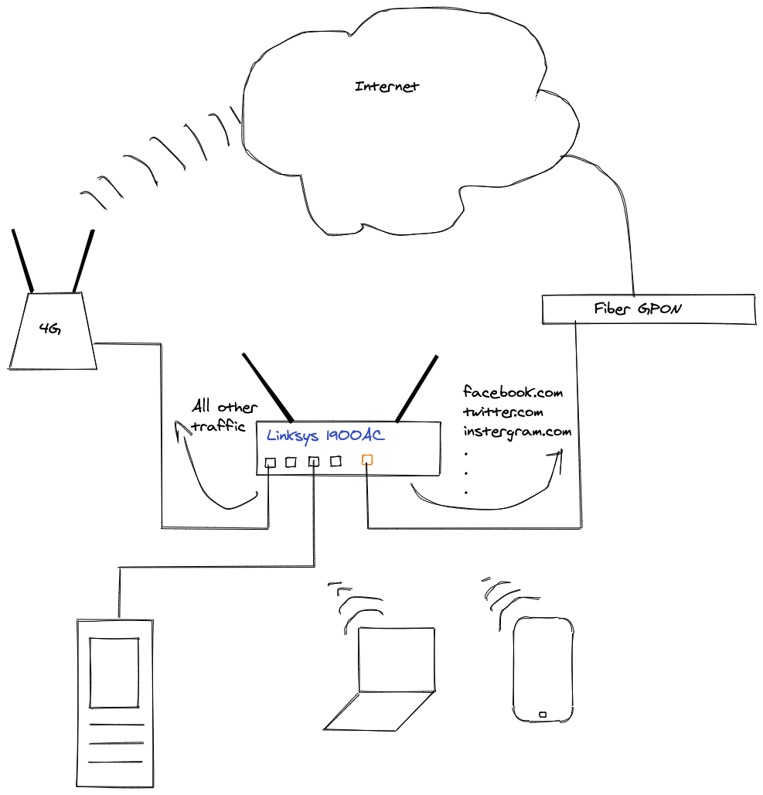
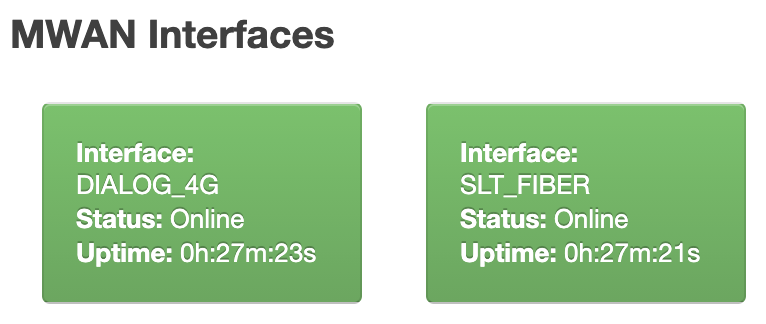
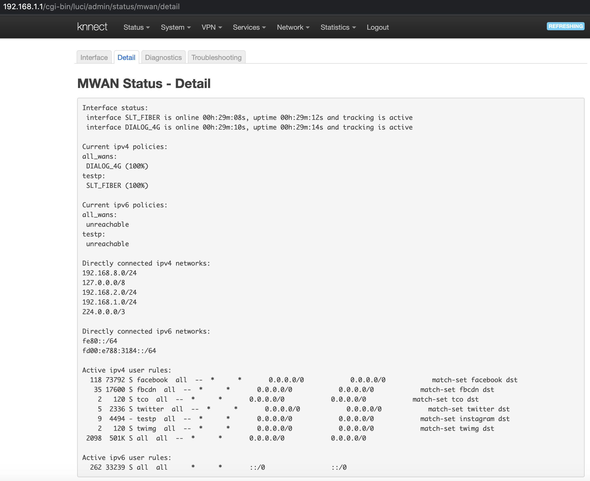
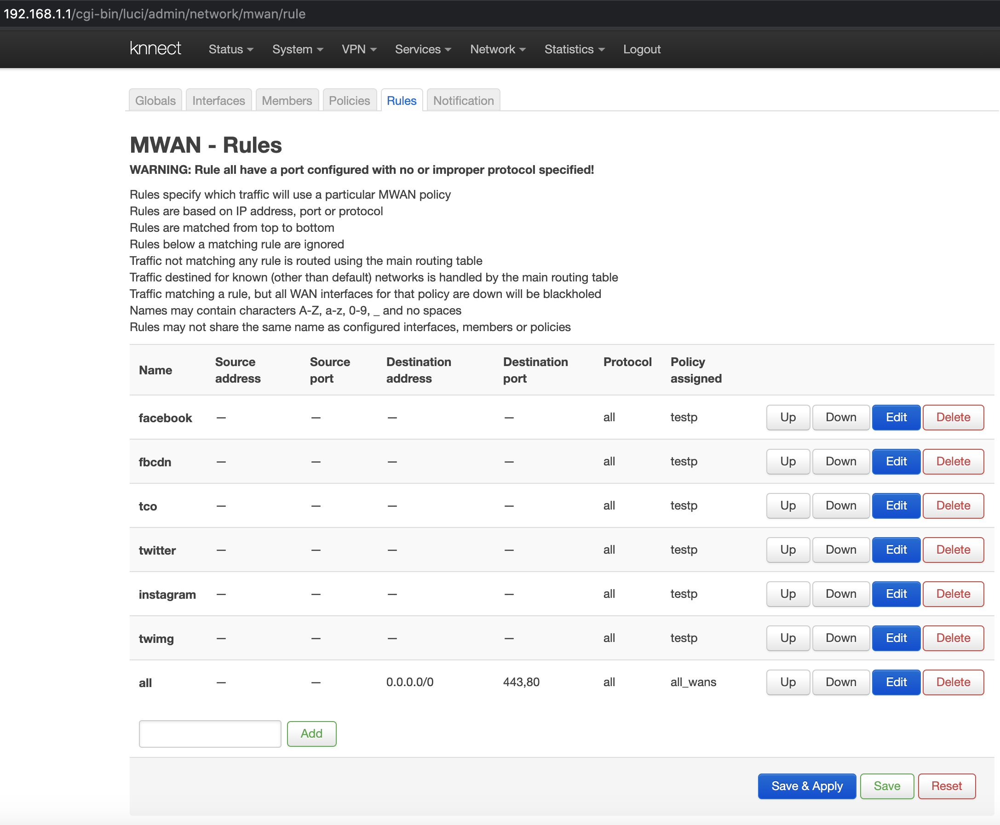
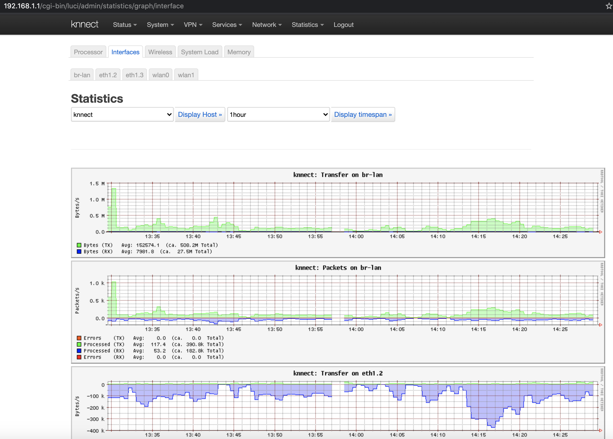

# Network plan

My main requirement was to route the internet traffic to specific WAN connection conditionally depending on it's hostname. For example, If someone try to access `facebook.com`, `twitter.com` or `youtube.com` etc. I wanted those requests to be routed via a specific WAN (or internet router) and all the other request goes through 2nd internet connection (WAN).

Second requirement was to monitor and collect stats about my home local network usage and persist them for later analysis. One of the motivational factor for collecting usage data was,there are rumors in our country that some Internet Service Providers(ISPs) charge for more data than what the user has actually consumed :)

Below is my network setup:



I'm using [`Linksys WRT 1900AC V2 (Cobra)`](https://www.linksys.com/us/support-product?pid=01t80000003KdJ7AAK) router with [OpenWRT](https://openwrt.org/) latest firmware(v19.07.5).

Diagram sources: [lucid](https://lucid.app/lucidchart/invitations/accept/98104790-f585-4b6c-8e90-58e513880562) & [excalidraw](https://excalidraw.com/#room=587b683f2467ed94de73,rXcfIg77oPYxdlxKc32nvw)

# OpenWRT Multiple WAN configuration

To begin with , You need to setup ssh on the OpenWRT router and access the router as root user `ssh -v root@192.168.1.1`. Most of the configurations can be done via the web UI but, It's easy to track the changes when configuring via command line, I used to take backups using `scp` and edit the config files in laptop and push them back to router via `scp`.

OpenWRT has a `mwan3` package which allows you to configure various rules and policies on WAN connections. I have use `mwan3` to configure the conditional load balancing/routing to achieve my above requirement.

To [install](https://openwrt.org/docs/guide-user/additional-software/managing_packages) the `mwan3` package use

```
opkg update
opkg install mwan3
```
After installing `mwan3` keep it aside and configure the [IPSet](https://wiki.archlinux.org/index.php/Ipset), and later we can refer the IPSet names and create `mwan3` config file at once.

To configure dynamic hostname base WAN routing you need to do 3 things

1.  create a ipset
    ```
    ipset -N twitter hash:ip
    ```
    in the above `twitter` is the name of ipset `hash:ip` is a template kind of thing, When router get it's first ping request.
    Following command will list all the ip sets
    ```
    ipset list
    ```
    To get information about a specific ip set
    ```
    ipset -L twitter
    ```
    Where `twitter` is the IP set name,
    If system has resolved IPs for the name , Then those IPs will be shown under `Members` parameter
    ```
    root@knnect:~# ipset -L twitter
    Name: twitter
    Type: hash:ip
    Revision: 4
    Header: family inet hashsize 1024 maxelem 65536
    Size in memory: 416
    References: 1
    Number of entries: 9
    Members:
    69.195.179.128
    69.195.182.128
    69.195.165.128
    104.244.42.2
    104.244.42.194
    104.244.42.66
    69.195.177.128
    209.237.193.128
    104.244.42.130
    ```
    Important thing to note here is, When you run above command ip set will be added to the memory, and they don't get persisted. Hence restarting the router will clear all the added ipset. In other words ipset rules are saved in memory, upon a reboot they will be lost.
    Because of that I have created a startup script ([source code](https://gist.github.com/tmkasun/4f9e1fe6ed8254a115d2924f6b3b885d))
    ```
    /etc/init.d/autoipset
    ```
    to add all the ip sets I want when starting up the router. Instructions are given in above gist source on how to add the startup script. For more info about how to write init script in OpenWRT follow [this official doc](https://openwrt.org/docs/techref/initscripts)
2. Update `dnsmasq.conf` with ipset name and dns name
    > What is [dnsmasq](https://openwrt.org/docs/guide-user/base-system/dhcp.dnsmasq)

    Open the 
    ```
    /etc/dnsmasq.conf
    ```
    in router, and add ipset entries as below
    ```
    ipset=/.twitter.com/twitter
    ```
    here, AFAIK `twitter` after the last slash is the ipset name, Following is a sample `dnsmasq.conf` configuration content
    ```
    # /etc/dnsmasq.conf
    # Change the following lines if you want dnsmasq to serve SRV
    # records.
    # You may add multiple srv-host lines.
    # The fields are <name>,<target>,<port>,<priority>,<weight>

    # A SRV record sending LDAP for the example.com domain to
    # ldapserver.example.com port 289
    #srv-host=_ldap._tcp.example.com,ldapserver.example.com,389

    ipset=/.facebook.com/facebook
    ipset=/.instagram.com/instagram
    ipset=/.fbcdn.net/fbcdn
    ipset=/.twitter.com/twitter
    ipset=/.twimg.com/twimg
    ```
    after updating the config file run 
    ```
    service dnsmasq restart
    ```
    to refresh the `dnsmasq`
    Note here: 
    In my case default `dnsmasq` tool coming with the OpenWRT installation does not worked and I had to uninstall the pre-installed `dnsmasq` and install `dnsmasq-full` to get this work!
3.  Now IP sets are ready, So final thing is to configure the `mwan3`
    
    
    If you are new to `mwan3` there is a really good [documentation in OpenWRT](https://openwrt.org/docs/guide-user/network/wan/multiwan/mwan3) docs,covering all the aspects.

    At this point, better to restart the router, and ping to those host name that you have configured above i:e
    ```
        ping twitter.com
    ```
    If you are curious about IPs and DNS, When you ping you will get one of following IPs at the time you execute the ping command
    ```
    whois -h whois.radb.net -- '-i origin AS13414' | grep ^route
    ```
    If you wonder how it resolve all the IPs , Google search about [ASN Lookup](https://www.ultratools.com/tools/asnInfoResult?domainName=twitter), I also initially though that how to [find all the IPs belongs to a particular](https://stackoverflow.com/questions/11164672/list-of-ip-space-used-by-facebook) domain and i might need to add them to routing table or something like that, But it's not required here.
    ok that is for your information about AS codes and IPs , now run the 
    ```
        ipset -L twitter
    ```
    command and check whether the member IP have resolved
    Configuring the `mwan3` can be done via the UI too. But i will put the configuration elements here for convenient.
    I assume that you are somewhat familiar with OpenWRT and `mwan3` configurations, Hence will directly jump into mwan3 config.
    `mwan3` config is located in
    ```
    /etc/config/mwan3
    ```
    and following is a sample configuration
    ```
        config rule 'facebook'
            option proto 'all'
            option sticky '1'
            option ipset 'facebook'
            option use_policy 'testp'
    ```
    In above rule config,
    option sticky: Is important to set true in UI or '1' in the config
    option ipset: Is the IP set name created with `ipset -N {name}` and the `ipset={domain}/{name}` in the config file
    option use_policy: is the policy name which have the WAN as a member that you want to forward the request match with the above ipset (i:e facebook.com requests go to Dialog 4G WAN)
    Change the above config accordingly and put it in the `mwan3` config at the top (will get the priority from configs in top to bottom)
    
    Finally restart the `mwan3` service
    ```
    mwan3 restart
    ```
    and check the `mwan3` status
    ```
    mwan3 status
    ```
    or check the status from the web UI
    
    it should show the above added new rul in `Active ipv4 user rules:` section

# Monitoring traffic

    This is about monitoring the home network traffic using the OpenWRT, This is a different topic than the above discussed topic.



I have used [`luci_app_statistics`](https://openwrt.org/docs/guide-user/luci/luci_app_statistics) package in OpenWRT, It provide good coverage of parameters, from Network interfaces, to memory & CPU usages and there are lot more supported in `collectd`. This package  gives more similar graph outputs this is available in [LERAN traffic graphs](https://lnms.learn.ac.lk/traffic/int.php). So i believe this `luci_app_statistics` package give more professional looking stats in OpenWRT routers.

The default `rrd` configuration store the monitoring data in the temporary directory (`/tmp/`) hence the graph data get cleared when router is  restarted. In the above doc , they have pointed to some scripts and docs which explains how to backup the data to an external device plugged into router's USB interface. Only thing lacking there is how to use existing vFat/Fat32 formatted pen drive to backup the data. So I had to google and collect the information from various sources, and though of organizing them here.
To get [vFat/FAT32 partition](https://openwrt.org/docs/guide-user/storage/filesystems-and-partitions) mounted you need following package in the router 
```
opkg install dosfstools
```
And then simply follow the instruction in [usb-installing](https://openwrt.org/docs/guide-user/storage/usb-installing) and [usb-drives](
https://openwrt.org/docs/guide-user/storage/usb-drives)
To take a backup every X (i:e 6 hours) interval, You can use [this script](https://gist.github.com/squarewf/a2347fe44e217a19998eb2b6b1b16c59) This sheduling is done using [the corntabs](https://openwrt.org/docs/guide-user/base-system/cron)

# References
-   This [Openwrt forum thread](https://forum.openwrt.org/t/mwan3-rules-with-ipset/52577/23) healped me a lot to figure out this path.
-   And this [StackOverflow answer](https://stackoverflow.com/questions/48592840/applying-ipset-in-lede) helps to find out about ipset list command and important of restarting and setting up the order for startup script (set ips before 19)  
- This [blog post in nicedoc.io](https://nicedoc.io/hardenedlinux/Debian-GNU-Linux-Profiles/blob/master/docs/dns/domain-name-based-routing.md) was also helpful.
- I created this [github repo](https://github.com/tmkasun/openwrt_configs) with all the configuration files and script for reference